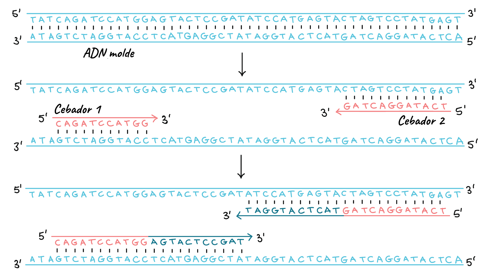

# PrimerDesigner

## Description and Objectives

The purpose of this program is to determine an optimal universal primer that achieves maximum hybridization with all sequences aligned in a fasta file. This exercise is especially useful when the aligned sequences in the file have some kind of relationship among them. For example, they may all belong to orthologs of the same gene or refer to different strains of a particular virus.

Thus, the primer provided by our program will allow reliable laboratory techniques such as detection, sequencing, or PCR amplification to be performed when it is unknown which of the sequences in the file we are dealing with. This is a common scenario in PCR tests when we don't know the strain that the study patient may contain, which is why the existence of a universal probe capable of detecting any of them is necessary.

<div align="center">
    
</div>

## Constraints

The design of a good primer must mainly consider four parameters:

- **Complementarity**: This is the main requirement that a primer must fulfill, which takes precedence over all others. To ensure primer hybridization with the template, it should be as complementary as possible to it. This requirement poses no problem when there is a single known sequence, as you can easily determine the 100% complementary sequence to the template. However, in our case, since we have multiple sequences, we need to find the region that maximizes the number of conserved columns among them to ensure that the complementary sequence we design is truly complementary to all of them.

- **3' End Affinity**: This is another fundamental requirement closely related to the previous one. This constraint means that the 3' end of our primer must have 100% complementarity with all sequences. If this is not possible, our program cannot provide a solution.

- **Length**: Generally, a primer's length should be between 17 and 23 nucleotides to ensure stability during laboratory manipulation.

- **Temperature**: In addition to the above, to avoid problems such as primer denaturation or nonspecific amplification, our primer needs to have an associated melting temperature of around 60 degrees Celsius. This temperature is calculated using Wallace's formula:

$$
\text{Tm = 2(A+T) + 4(G+C)}
$$

## Procedure

The first step consists of reading the fasta file provided as an input parameter in the program. Since we do not know the number of sequences contained in the file beforehand, we will use a list of strings for storage. To do this, we will iterate through the document line by line, identifying the start of a new sequence by the ">" character. Each new sequence will be added to the list so that it can later be converted into a character matrix.

After constructing the matrix, we begin the search process by creating two vectors. The first vector will contain a consensus sequence formed by the most frequent nucleotide in each column. The second vector will have the corresponding reliability percentage for each nucleotide in the consensus sequence. In case of a tie, the program is designed to prioritize the letters G and C over A and T since the former have a stronger hybridization force. Of course, in case of a tie, a gap would never be written as it would result in information loss. A simple example would be:

<div align="center">

| SEQ   |  Sequence       |
|-------|-----------------|
| SEQ 1 | 5’  ACTA--CAAT 3’ |
| SEQ 2 | 5’  AGC-CC-CTT 3’ |
| SEQ 3 | 5’  GCT-AC-AAT 3’ |
| SEQ 4 | 5’  GCTA--CAAT 3’ |
| **CONSENSUS** | 5’ GCTA-CCAAT 3’ |

</div>

Once we have obtained the two aforementioned vectors, we proceed to iterate through the reliability vector in search of the region that maximizes the sum of the percentages of its positions and also fulfills all the previously described requirements. This is because even though these conditions are for the primer and not for the template sequence, since the primer will be the reverse complement sequence of the template, fulfilling the conditions in the template means the same fulfillment in the primer.

To achieve this, we use a for loop in which, for each iteration, we iterate through another while loop to simulate the growth from that position of our oligo. In order for the growth to continue and therefore stay within the while loop, we cannot encounter any gaps in the consensus sequence, and the first 5 nucleotides during the growth must have a reliability of 1. This is due to the condition of requiring 100% complementarity at the 3' end of the primer.

During that while loop, a condition will be applied so that if the growth has managed to reach 17 nucleotides with a temperature higher than 55 °C and has also surpassed the best score so far, it will be temporarily saved as a solution until another one improves it. In these cases, the while loop continues to analyze until we encounter a gap, surpass 23 nucleotides, or the temperature reaches 60 °C.

We must not forget that the solution to this process refers to the region of the sequence that can offer us the highest reliability. Therefore, we need to calculate the reverse complement sequence of what we have in order to name it as the resulting universal primer from the program.

Finally, our program will provide the following results:

- Consensus sequence.
- Reliability vector.
- Template sequence for designing the primer, along with its position within the consensus sequence.
- Universal primer with its length and associated melting temperature.
- Hybridizations of the primer in each sequence to check the effectiveness of our result.

## Code Explanation

Given the length of our program, I will present the functions that are most understandable and significant to complement the procedure described above. For the construction of our program, I have used two different classes. The first one, called Lectura.java, is responsible for receiving the input file and converting it into a character matrix. On the other hand, the class Cebador.java will focus on calculating our universal primer and providing the system's output.

For the first class, we have a single function with the following code:

```java
public char[][] leeFichero(String fichero) {
    List<String> listaRes = new ArrayList<String>();
    String res_i = "";
    try {
        Scanner sc = new Scanner(new File(fichero));
        sc.nextLine();
        while (sc.hasNextLine()) {
            String linea = sc.nextLine();
            if (linea.startsWith(">")) {
                listaRes.add(res_i);
                res_i = "";
            } else {
                res_i += linea;
            }
        }
        listaRes.add(res_i);
    } catch (FileNotFoundException e) {
        e.printStackTrace();
    }
    if (listaRes.size() < 2) {
        throw new RuntimeException("El fichero introducido no es correcto");
    }
    char[][] res = new char[listaRes.size()][listaRes.get(0).length()];
    for (int i = 0; i < listaRes.size(); i++) {
        if (i < listaRes.size() - 1 && listaRes.get(i).length() != listaRes.get(i + 1).length()) {
            throw new RuntimeException("El fichero introducido tiene secuencias de distinta longitud");
        }
        for (int j = 0; j < listaRes.get(i).length(); j++) {
            res[i][j] = listaRes.get(i).charAt(j);
        }
    }
    return res;
}
```

As we can see, the function is divided into two parts. In the first part, we take care of sequentially reading the file provided as an input parameter and check that the document contains more than two sequences because otherwise, we cannot proceed with our purpose. In the second part, we convert the initial list of sequences into a character matrix, ensuring that they all have the same length and are aligned. 

The next class is a bit more complex, so I will only show its main method. It uses auxiliary functions whose purpose is described by their own name.

```java
public void compute(char[][] sec) {
    char[] secuenciaConsenso = new char[sec[0].length];
    double[] fiabilidad = new double[sec[0].length];
    calculaSecConsensoYFiabilidad(sec, secuenciaConsenso, fiabilidad);
    int[] posInPosFinTemp = calculaPosMaxFiabilidad(secuenciaConsenso, fiabilidad);
    int posInicial = posInPosFinTemp[0];
    int posFinal = posInPosFinTemp[1];
    int temperatura = posInPosFinTemp[2];
    String molde = String.valueOf(secuenciaConsenso).substring(posInicial, posFinal);
    cebador = calculaInvCom(molde);
    String hibridaciones = calculaHibridaciones(sec, posInicial, posFinal, molde);
    String StringFiabilidades = "";
    for (double v : fiabilidad) {
        StringFiabilidades += " " + v;
    }
    resultadoCompleto = "Secuencia consenso: 5'- " + String.valueOf(secuenciaConsenso) + " - 3' \n"
            + "Fiabilidades: " + StringFiabilidades + "\n"
            + "Molde Secuencia Consenso: 5'- " + molde + " - 3'" + "  Posición: " + posInicial + " - " + posFinal + "\n"
            + "Cebador universal: 5'- " + cebador + " -3'"
            + "   Longitud: " + (posFinal - posInicial) + "   Temperatura: " + temperatura + "ºC" + "\n"
            + "Hibridaciones del cebador en cada secuencia: \n"
            + hibridaciones;
}
```

In it, we can see that it follows the previously described procedure. We start with the declaration of the consensus sequence and reliability vectors, search for the region of maximum complementarity, determine the template, and finally calculate the reverse complement sequence to obtain the universal primer.

After all that, we construct a string with all the stored information, which will be provided as the output on the screen and saved in the output file.

To delve into the search algorithm, I will now show the code snippet corresponding to the loops mentioned in the previous section.

```java
for (int i = 0; i < fiabilidad.length; i++) {
    gap = false;
    hibridacionTresPrimaCebador = true;
    valorZonaActual = 0;
    tempActual = 0;
    j = 0;
    while (!gap && hibridacionTresPrimaCebador && j < 23 && tempActual < 60 && i < fiabilidad.length - 23) {
        if (secuenciaConsenso[i + j] == '-') {
            gap = true;
        }
        if (j < 6 && fiabilidad[i + j] < 1) {
            hibridacionTresPrimaCebador = false;
        }
        tempActual += temperaturas.get(secuenciaConsenso[i + j]);
        valorZonaActual += fiabilidad[i + j];
        j++;
        if (!gap && hibridacionTresPrimaCebador && valorZonaActual / j > maxAlcanzado && j > 17 && tempActual > 55) {
            maxAlcanzado = valorZonaActual / j;
            res[0] = i;
            res[1] = i + j;
            res[2] = tempActual;
        }
    }
}
if (res[1] == 0) {
    throw new RuntimeException("No es posible la construcción de un primer universal");
}
```

Where the only thing left to mention is that if the minimum necessary conditions for primer design are not met at any point, an exception will be thrown to report this situation.

## Test  

For this program, given the complexity of the output, I have created two test classes that perform fairly simple checks. Most of the tests are aimed at error detection:

 - **LecturaTest**: As the name suggests, it focuses on executing test cases for the "Lectura" class, which is responsible for analyzing the input file. In this case, I have designed three tests consisting of providing a file without headers, another file with a single sequence, and finally, a file where the sequences are not aligned. Therefore, the expected response from the program in all three cases is to throw an exception.

```java
public class LecturaTest {
    @Test
    public void laLecturaDeUnFicheroCon1SecuenciaDaError() {
        Lectura l = new Lectura();
        assertThrows(RuntimeException.class, () -> l.leeFichero("Fichero1secuencia.fasta"));
    }

    @Test
    public void laLecturaDeUnFicheroSinCabecerasDaError() {
        Lectura l = new Lectura();
        assertThrows(RuntimeException.class, () -> l.leeFichero("FicheroSinCabeceras.fasta"));
    }

    @Test
    public void laLecturaDeUnGFicheroSinAlinearDaError() {
        Lectura l = new Lectura();
        assertThrows(RuntimeException.class, () -> l.leeFichero("FicheroSinAlinear.fasta"));
    }
}
```

- **CebadorTest**: In this case, we will test the functionality of the "Cebador" class. For this purpose, I have designed two tests, one intended to fail and the other to clearly succeed. The test designed to make the program fail consists of three strategically assembled sequences in a way that the consensus sequence prevents the implemented algorithm from finding a solution. On the other hand, the other test consists of two identical sequences filled with gaps except for 20 consecutive nucleotides, whose temperature falls between 55 and 60 degrees, clearly defining the only possible solution.

```java
public class CebadorTest {

    @Test
    public void elCebadorDeUnFicheroConMuchosGapsDaError() {
        Lectura l = new Lectura();
        char[][] secuencia = l.leeFichero("FicheroMuchosGaps.fasta");
        Cebador c = new Cebador();
        assertThrows(RuntimeException.class, () -> c.compute(secuencia));
    }

    @Test
    public void elCebadorDeUnFicheroConTodoGapsMenos20NucleotidosDaLaComplementariaDeEllosMismos() {
        Lectura l = new Lectura();
        char[][] secuencia = l.leeFichero("TodoGapsMenos20NucleótidosAlineados.fasta");
        Cebador c = new Cebador();
        c.compute(secuencia);
        assertEquals("ACGCGTCATATATCTGCGT", c.getCebador());
    }
}
```


## Examples  

For the execution of our program, in addition to the executable examples in the environment, I have built a JAR file that allows its usage through a terminal by providing the input file as a parameter.

In addition to the FASTA files included in the project, the corresponding PDF documents containing the alignments of the input sequences for each example will be attached to this report.

1. Executables in the environment 
- Example 1: 


- Example 2: 


- Example 3: 


2. Executed by console by using the jar file
- Example 4: 


Where we can see that for the console version, I have decided to remove the letter coloring since not all consoles support this feature, and in such cases, the result would be displayed illegibly.

Lastly, I would like to mention that after each of these executions, as shown at the end of each screenshot, the result is saved in a .txt file, which I will also provide as attachments to the report.